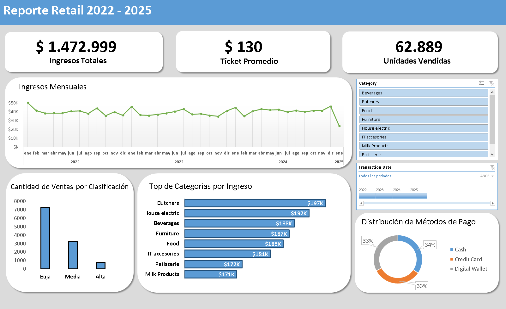

## Análisis de Retail Store Sales

**Dataset:** Retail Store Sales: Dirty for Data Cleaning, publicado en Kaggle por Ahmed Mohamed.

**Link:** https://www.kaggle.com/datasets/ahmedmohamed2003/retail-store-sales-dirty-for-data-cleaning

El objetivo del proyecto fue simular un análisis de respuesta rápida sobre datos de ventas de un supermercado utilizando Excel, a partir de un dataset de más de 12.000 registros.

**Herramientas Utilizadas:** Microsoft Excel (Power Query, funciones y Tablas Dinámicas)

## Insights

- El **Revenue (Ingresos Totales)** alzanzó los $1.472.999 durante el periodo analizado.

- Con un **Ticket Promedio de $130** y una gran cantidad de ventas de categoría "Baja", el negocio posee un modelo de ventas minorista (retail).

- El ritmo de ventas fue constante entre 2022 y 2024. Inicialmente se detectó una caída significativa en enero de 2025 respecto a diciembre de 2024, pasando de **$46.293 a $24.212**, lo que representa una disminución de **casi el 48% en un período de 30 días.**

- Sin embargo, tras una revisión, se confirmó que los datos de enero solo incluyen registros hasta el **18 de enero**, por lo que la caída se debe a un recorte temporal de los datos y no a una disminución real de los ingresos.

- Las categorías **Butchers (Carnicería)** y **House electric (Hogar)** son las dos líneas de productos principales. Si bien lideran el ranking, la diferencia con las demás categorías es bastante estrecha.

- No se observa una preferencia principal por un único método de pago. Las distintas opciones tienen una participación similar en los ingresos totales.

## Recomendaciones Estratégicas

- Se recomienda ingresar los datos restantes de enero de 2025 para normalizar el reporte, y establecer un proceso de carga de mes completo para evitar falsas alarmas en futuras métricas.

- Continuar ofreciendo todas las opciones de pago actuales, sin modificaciones. Las tres opciones rinden, y eliminar una afectaría a un tercio de los ingresos.

- Como se vio, aunque hay categorías dominantes, no hay una diferencia tan marcada. Se debe evitar priorizar una sola, y mantener una disponibilidad de stock constante en cada una, para no perder ventas en ninguna sección.

## Datos y Pasos Realizados

Se trabajó con un dataset de 12.575 registros, que luego del proceso de limpieza en Power Query quedó conformado por 11.362 registros válidos. Las variables utilizadas para el análisis fueron:

- Transaction_ID, Category, Item, Price Per Unit, Quantity

- Payment Method, Transaction_Date, Total, Clasificación

**Acciones de Limpieza y Transformación:**

- Reducción de registros del dataset original mediante la eliminación de duplicados y valores nulos. Estos fueron eliminados ya que no representaban una pérdida significativa de información para el análisis final.

- Se removieron espacios en blanco invisibles de columnas de texto para corregir inconsistencias en los nombres.

- Conversión de columnas a formato de Moneda y Fecha para poder realizar cálculos sobre ellas.

- Eliminación de la columna "Total" original, para luego recalcularla sobre los datos limpios, asegurando su validez.

- Ajuste de nombres de algunas categorías en la columna Category.

- Creación de una variable condicional "Clasificación" para clasificar ventas en "Baja" (<$100), "Media" (Ventas entre $100 y $300) y "Alta" (>$300).

- Visualización: Diseño de un Dashboard Interactivo con tablas y gráficos dinámicos, integrando segmentadores y líneas de tiempo.

